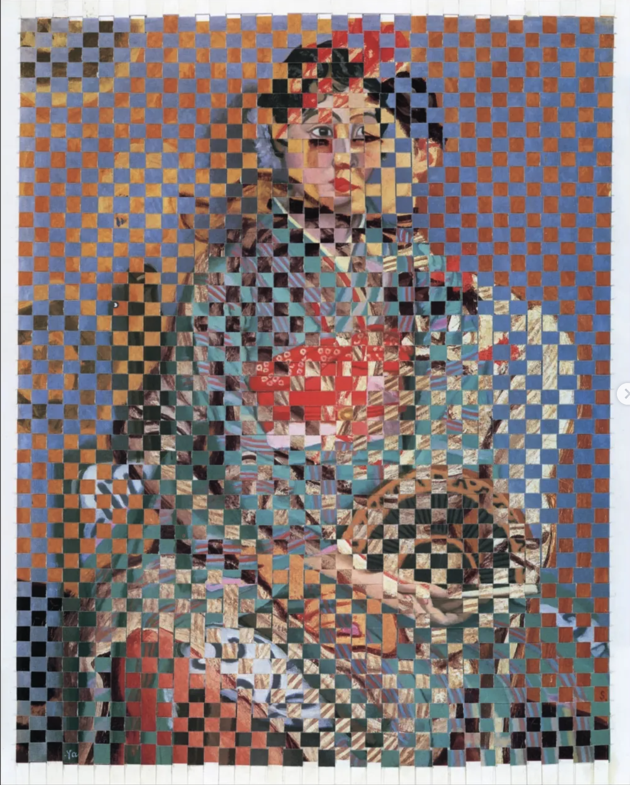
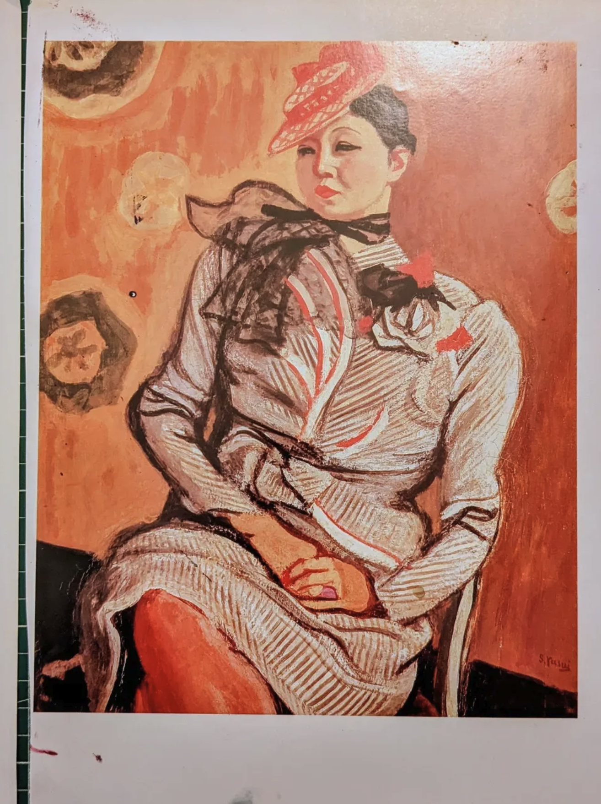
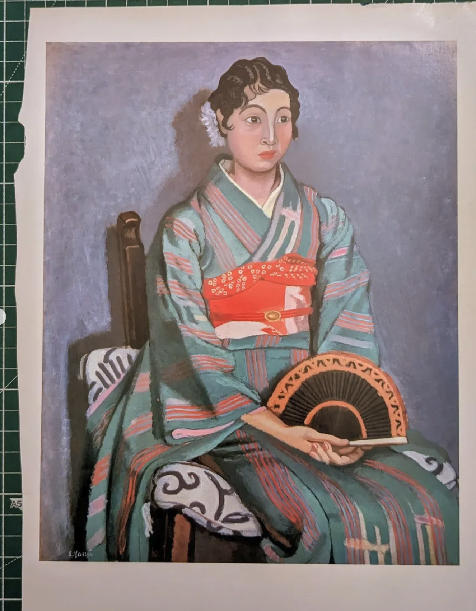

# Tejido

### A custom-built tool designed for Barcelona-based visual artist Alejandro Beltrán ([@blancodeorilla](https://www.instagram.com/blancodeorilla/))

Beltrán weaves strips of paper into intricate patterns—often checkerboard designs but also tribal motifs he learned while traveling in the Amazon. By interlacing threads from two distinct images, he merges separate visual narratives, creating a unique dialogue between them and forming an entirely new artistic language.

With Tejido, you can preview various patterns and image combinations, enabling seamless experimentation and precise control—perfect for refining designs and commissioned projects.

Woven from these two separate images:

  
  

## [checkout tejido live](https://tejido.vercel.app/)
